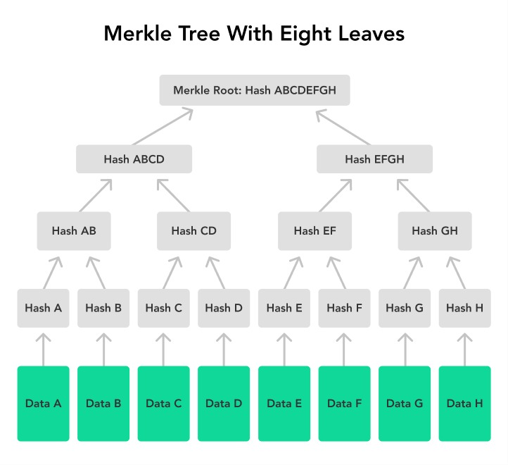

# $\color{#FFD700}{\text{ Se.Cre.Di.Ver}}$
## *Selective Credential Disclosure & Verification*
 

$\color{#FF0000}{\text{To run the code, know the folder structure or know the topics used refer to the instructions at the last}}$
 
 
 

**-By** : *Aryan Kurkure*;  25125004
          *Devansh Masani*.  25125011   

**-Pursuing** : *B.Tech in Data Science & Artificial Intelligence, IIT Roorkee*.

**-Date** : *10th April 2026*.

 
 
 

## $\color{#FFD700}{\text{-> Problem Statement :}}$

In our daily life, we often need to prove who we are — like for jobs, entering buildings, or creating accounts online. But the current system is not good. To prove something simple, we end up sharing too much personal information. This creates a problem between **privacy and trust**.

---

### **1. The Aadhaar problem Over-Disclosure**  
Think about when you use your Aadhaar card just to show your age.  

* To prove you are "18+", you show your full details like address and other personal info.  
* This is not needed for such a small task.  
* Once you share this data, you don’t know how it will be used later.  

---

### **2. The "Photoshop" Fraud**  
There is also a problem with fake documents.  

* People can easily edit certificates using simple tools.  
* There is no easy way to check if a document is original or not.  
* Because of this, it is hard to trust digital files.  

---

### **3. The "FAKE" Credential & The Waiting Game**  
Checking credentials is slow and difficult.  

* **The Phone Call Loop**: Sometimes people have to call or email to verify a degree, which takes time.  
* **The Revocation Problem**: If a credential is canceled, there is no fast way to inform others.  
* So, fake or old credentials can still be used.  

---

### **4. Data Correlation**  
We all have seen this — you give your number once, and then you get spam calls.  

* When we share our data, it can be stored and used later.  
* Companies may track or share this data.  
* A small step can create big privacy problems.  

---

 
 
 

## $\color{#FFD700}{\text{-> Solution :}}$

The idea of **SeCreDiVer** is to fix the privacy vs trust problem. Instead of forcing users to share all their personal data, our system lets them prove things in a secure way without revealing everything.
We use some basic cryptography concepts to achieve this:

### **1. Privacy using Selective Disclosure (SHA-256 Hashing)**  
To solve the Aadhaar over-sharing problem, we use **Selective Disclosure**.
* Instead of sharing actual data, the user can share a **hash (SHA-256)** of the data.  
* You can think of a hash like a **digital fingerprint**.  
* The verifier knows it is valid, but cannot see the original value (like address or phone number).  

---

### **2. Data Safety using Merkle Trees (Integrity Check)**  
To stop users from editing certificates, we use **Merkle Trees**.
* Each field is converted into a hash and combined into a tree structure.  
* This creates a final value called the **Merkle Root**.  
* If even one small value changes, the root also changes.  
* So, any tampering can be easily detected.  

---

### **3. Authenticity using ECDSA (No More Manual Verification)**  
To avoid calling or emailing institutions, we use **ECDSA digital signatures**.

* The issuer signs the credential using a **private key**.  
* The verifier checks it using a **public key**.  
* This process is fast and happens instantly.  
* No need to manually verify documents anymore.  

---

### **4. Revocation System (Cancel Invalid Credentials)**  
To handle fake or canceled credentials, we use a **revocation list**.

* All invalid credentials are stored in a list (blacklist).  
* During verification, we check if the credential is in this list.  
* If yes, it is rejected immediately.  

---

 
 

---

## $\color{#FFD700}{\text{-> Project Flow :}}$

The **SeCreDiVer** system is divided into different parts to keep things simple and secure.

---

1. **Core (`core/`)**  
   This contains the main logic like elliptic curve math and Merkle tree functions.  
   It handles all the cryptographic operations.  

---

2. **Issuer (`issuer/`)**  
   This part is used by institutions to create and sign credentials.  
   It also manages the revocation list.  

---

3. **Holder (`holder/`)**  
   This is the user’s wallet.  
   The user can store credentials and hide sensitive fields using hashing.  

---

4. **Verifier (`verifier/`)**  
   This checks if a credential is valid or not.  
   It verifies:
   - data integrity (Merkle Tree)  
   - signature (ECDSA)  
   - expiry and revocation status  

---

5. **App (`app.py`)**  
   This connects everything together using **Streamlit**.  
   It provides a simple interface to test issuer, holder, and verifier roles.  

---

 
 
 

## -> Table of Contents :
 
 
# streamlit interface explanation

1. Issuer page
2. Holder page
3. Verifier page

 
 
 

### # Streamlit explanation -
   It consists nothing to the logical essence of the project but to the interface part, and enables locally hosting the project for better experience of how the project would look like in case its adapted in the ongoing digital era.
   Some of the importantly used functions from the streamlit library after importing it via *import streamlit as sl* are :
   1. **sl.set_page_config()** -> It takes in parameters like *page_title, page_icon and layout* which help customize the appearance;
   2. **sl.tabs()** -> It helps create several pages of interaction within the same page of the interface, it takes in list of names of the tabs which we want to create and returns the same number of tabs which can be unwrapped as, tab1, tab2,... =sl.tabs(["..", "..", ...]);
   3. **sl.session_state** -> Undeniably its the most important part of the project as, streamlit hosted interface has the issue of reloading everytime there's interaction between the interface and the user, so in order to save the inputs etc. between those updations we use sl.session_state;
         * Eg; sl.session_state.authority is used to store the name of the institution; further more its important to check if some object like 'authority' exists within sl.session_state we check it using membership operators like *"in"* !
   4. Presentation of data -> *(all take in strings as input)*
      * **sl.title()**;
      * **sl.header()**;
      * **sl.subheader()**;
      * **sl.write()**;
      * **sl.json()**; *unlike others this also takes dict, list as inputs along with json formatted string as input, and unlike others which only allow showing text data, this one allows for showing json data.*

 

*sl.divider() is used to create lines in order to partition between two i/o structures of interface*
 

   5. Different inputs method ->
      * **sl.text_input()** ; provide one main compulsory string for asking the user about what he/she is supposed to enter and *placeholder='..'* which is like an sample input;
      * **sl.radio()** ; provide a list of possible options in strings out of which one can be selected and would be presented as the returned value;
      * **sl.file_uploader()** ; one main string stating what is expected to be uploaded and then keyword argument *type=[..]* which asks for the data type of files, in our case json.
   6. Showing status of operations in interface -> *(as name suggests, and all take string as message to be diplayed)*
      * **sl.success()**;
      * **sl.warning()**;
      * **sl.error()**.
   7. To trigger any operation, we use **sl.button()**.

 
 

### **I. Issuer page -**
Allows the issuer to;

   1. **Register an institution** by entering its name and clicking **SUBMIT**. Upon submission, an **IssuerAuthority** object is created and stored in **sl.session_state.authority**. This object internally calls **genKeys()** which generates a cryptographic keypair for the institution consisting of a *private key* and a *public key*, the mechanism behind which is explained ahead.

   2. **Add credential fields** one by one, each having a name, a type *(str, int, float, bool)* and a value entered through type-specific widgets. Each field is accumulated as a dictionary entry in **sl.session_state.fields_buffer** until issuance.

   3. **Issue a credential** by providing the holder's name and validity days, after which **issueCred()** is called. This internally builds a Merkle tree over the fields, signs the Merkle root with ECDSA, and packages everything into a credential dictionary which is saved to the local wallet directory via **save_cred()**.

   4. **View the issued credential** displayed via **sl.json()** directly beneath the issue section, showing all fields, the Merkle root, the ECDSA signature, timestamps, and the institution's public key.

 

#### Cryptographic operations triggered by the Issuer page :

 

##### a) Key generation — **genKeys()** in **core/ecdsa.py** :
   When the institution is registered, **genKeys()** is called. It picks a cryptographically secure random integer *d* in the range [1, n-1] as the **private key** using **secrets.randbelow()**. The **public key** Q is then derived as *d × G* where G is the generator point of the secp256k1 elliptic curve — a fixed standardised point agreed upon universally. This multiplication is performed by **scalMul()** in **core/ec.py** using the *double-and-add* algorithm, which is essentially repeated point addition on the curve but done efficiently by processing the binary representation of d.

   The security of this rests on the **Elliptic Curve Discrete Logarithm Problem** — given Q and G, finding d is computationally infeasible even with the most powerful hardware, because scalar multiplication on an elliptic curve is a one-way operation. The private key never leaves **sl.session_state.authority**; the public key is embedded into every issued credential via **xyTob64()** which serialises the EC point coordinates to a base64url string.

 

##### b) Field encoding — **encode_field()** in **core/fieldEnc.py** :
   Before any field value can be hashed, it must be converted to bytes in a consistent and unambiguous way. **encode_field()** takes the field name and its Python value and produces a UTF-8 encoded byte string of the format **name:type:value**. For example, a field named *degree* with value *BSc CS* becomes **b'degree:str:BSc CS'**. The type label is derived from **type(value).__name__** and is included in the encoding so that two fields with the same value but different types — such as integer 1 and boolean True — never produce the same byte string and therefore never collide in the Merkle tree.

 

##### c) Merkle tree construction — **mkTree()** in **core/merkle.py** :
   After all field pairs are collected, **mkTree()** is called with the list of *(name, value)* tuples. It works in two stages:

   - **Leaf layer** : each field is passed through **encode_field()** and then **hash_leaf()** which applies **sha256** to produce a 32-byte leaf hash. All leaf hashes form the bottom layer of the tree.
   - **Downward pairing** : adjacent leaves are paired and their concatenation is hashed using **hash_node()** to produce the next level. If the count at any level is odd, the last node is paired with itself. This repeats until only one hash remains — the **Merkle root**.

   The entire tree is stored as a list of lists of bytes, serialised to hex strings via **bytToStr()** before being stored in the credential dictionary, since raw bytes cannot be written to a JSON file.

   The significance of this structure is that changing any single field value changes its leaf hash, which cascades upward changing every ancestor hash, and ultimately changes the root. Since the root is signed by the issuer, any such change invalidates the signature and is immediately detectable during verification.

 

##### d) ECDSA signing — **sign()** in **core/ecdsa.py** :
   Once the Merkle root is obtained as bytes, **sign(root, self.priv_k)** is called. The signing process works as follows:

   1. The root bytes are hashed with **sha256** and converted to an integer *z* modulo *n*, producing the message digest.
   2. A fresh random nonce *k* is chosen from [1, n-1] via **secrets.randbelow()**.
   3. The point *R = k × G* is computed via **scalMul()**. The x-coordinate of R modulo n gives the signature component *r*.
   4. The signature component *s* is computed as *modinv(k, n) × (z + r × d) mod n* where *d* is the private key.
   5. The pair *(r, s)* is the signature. It is serialised to a dictionary of 64-character hex strings via **rsToDict()** for JSON storage.

   The nonce *k* is discarded immediately after use. It must never be reused — reusing k across two signatures mathematically leaks the private key. The final credential dictionary contains this serialised signature alongside the root hex, the public key, all fields with their types, the serialised Merkle levels, and the issuance and expiry timestamps.

 
 

### **II. Holder page -**
Allows the holder to;

   1. **Find credentials by name** — the holder enters their name and clicks **FIND MY CREDENTIALS**. The system calls **list_cred()** which reads all **.json** filenames from the wallet directory, then **load_cred()** on each, filtering those where **cred['holder']** matches the entered name. Matching credential IDs are stored in **sl.session_state.my_creds**.

   2. **Load or delete a credential** — from a radio selector showing all matching credential IDs, the holder can load a specific credential into **sl.session_state.last_cred** or delete it from disk via **del_cred()**.

   3. **Select an institution** — if multiple credentials exist for the same holder name from different institutions, a radio selector shows the issuer names and the corresponding credential is set as **sl.session_state.last_cred**.

   4. **Select fields to reveal** — field names from the loaded credential are displayed. The holder enters the indices of the fields they wish to reveal as space-separated integers, which are mapped to field names internally.

   5. **Create a disclosure** — clicking **SUBMIT QUERY** calls **showCred()** which rebuilds the Merkle tree from the stored fields, generates proof paths for revealed fields, and computes leaf hashes for hidden fields. The resulting disclosure dictionary is stored in **sl.session_state.last_disc** and offered for download as a JSON file via **sl.download_button()**.

 

#### Cryptographic operations triggered by the Holder page :

 

##### a) Merkle proof generation — **getProof()** in **core/merkle.py** :
   For each field the holder chooses to reveal, **getProof(tree, index)** generates the **sibling hash path** from that leaf up to the root. At each level of the tree, it identifies the sibling of the current node — the adjacent hash that was paired with it — and records whether that sibling sits to the left or right. This *(sibling_hash, side)* pair is collected for every level, giving a list of pairs that together allow anyone to independently recompute the root from just the leaf value.

   The proof path is what makes selective disclosure possible. The verifier can confirm a single field is genuine without needing to see any other field, because the proof path provides exactly the information needed to reconstruct the root — no more, no less.

 

##### b) Hidden field hashing — **hash_leaf()** in **core/hashing.py** :
   For every field the holder does **not** wish to reveal, **showCred()** takes that field's precomputed leaf hash directly from the tree's top layer — **ht[0][i].hex()** — and includes it in the disclosure under the **hidden** dictionary. The verifier receives these hashes but cannot reverse them to find the original values, since **sha256** is a one-way function. Yet the verifier still needs them to recompute the Merkle root when verifying revealed fields, because every leaf — revealed or hidden — contributes to the root computation.

   This is the cryptographic mechanism behind privacy in this system. Hidden fields are not absent from the disclosure — they are present as hash commitments. Their **existence is acknowledged but their content is protected**.

 

##### c) Disclosure packet structure :
   The disclosure dictionary produced by **showCred()** contains:
   - **issuer_public_key** — the base64url serialised EC point of the issuing institution.
   - **root** — the Merkle root hex string copied from the credential.
   - **signature** — the serialised ECDSA signature *(r, s)* copied from the credential.
   - **issued_at** and **expires_at** — ISO 8601 UTC timestamp strings.
   - **revealed** — a list of dictionaries, one per revealed field, each containing the field name, value, type label, leaf index, and Merkle proof path as a list of **[hex_string, side]** pairs.
   - **hidden** — a dictionary mapping each hidden field name to its leaf hash hex string.

   Every value in this dictionary is JSON serialisable, so **json.dumps()** called by **sl.download_button()** never raises a **TypeError**.

 
 

### **III. Verifier page -**
Allows the verifier to;

   1. **Upload a disclosure file** — the verifier uploads the **.json** disclosure file produced by the holder via **sl.file_uploader()**. The file bytes are read with **.getvalue().decode()** and parsed with **json.loads()**. The parsed dictionary is stored in **sl.session_state.disc**. If the JSON is malformed, an error is shown and no further action is taken.

   2. **Verify the disclosure** — clicking **VERIFY** calls **verifyDisc(disc)** from **verifier/verify.py**. This function runs four sequential checks and returns a *(bool, reason_string)* tuple. If valid, the revealed fields and their values are displayed along with the issuance and expiry timestamps and a list of hidden field names. If invalid, the exact reason is shown via **sl.error()**.

   3. **Revoke a credential** — an expander at the bottom of the page allows any actor to enter a credential root hex and call **revCred()** which appends it to the revocation registry file. Any future verification of that credential will fail at Check 4.

 

#### Cryptographic operations triggered by the Verifier page :

 

##### a) Check 1 — Expiry :
   **datetime.fromisoformat(disc['expires_at'])** parses the expiry timestamp stored in the disclosure. It is compared against **datetime.now(timezone.utc)**. If the current time is past the expiry, the function immediately returns **(False, 'Credential has expired !')**. This check requires no cryptography — it is a straightforward timestamp comparison — but it is placed first because it is the cheapest check to run and eliminates stale credentials before any heavier computation begins.

 

##### b) Check 2 — Merkle proof verification — **verifyProof()** in **core/merkle.py** :
   For each item in **disc['revealed']**, the verifier reconstructs the Merkle root from that single field and its proof path. The process is:

   1. The revealed field's name and value are passed to **encode_field()** and then **hash_leaf()** to reproduce the original leaf hash.
   2. The proof path is iterated. At each step, the current hash and its sibling are combined using **hash_node()**. The **side** value determines the order — if the sibling is on the left, it goes first; if on the right, the current hash goes first.
   3. After all levels are processed, the final computed hash must equal **bytes.fromhex(disc['root'])**.

   If any revealed field's computed root does not match the stored root, verification fails with **'Invalid proof for consistency !'**. This proves that either the field value was tampered with after issuance, or the proof path itself was wrong.

 

##### c) Check 3 — ECDSA signature verification — **verify()** in **core/ecdsa.py** :
   The verifier recovers the issuer's public key Q via **xyFromb64(disc['issuer_public_key'])** and the signature *(r, s)* via **dictToRS(disc['signature'])**. The root is converted to bytes via **bytes.fromhex(disc['root'])**. Then **verify(root_bytes, sig, Q)** is called:

   1. The root bytes are hashed and converted to integer *z* exactly as was done during signing.
   2. The modular inverse of *s* is computed. Then *u1 = modinv(s, n) × z mod n* and *u2 = modinv(s, n) × r mod n* are derived.
   3. The point *u1 × G + u2 × Q* is computed using **scalMul()** and **pointAdd()**.
   4. If the x-coordinate of this point modulo *n* equals *r*, the signature is valid.

   This works because the verification equation expands mathematically to reproduce the original nonce point only if the signer held the private key *d*. Without *d*, it is impossible to produce *(r, s)* values that satisfy this equation. A valid result here proves the credential was genuinely signed by the institution whose public key is embedded in the disclosure.

   If verification fails, the function returns **(False, 'Not authenticated by the institution !')**.

 

##### d) Check 4 — Revocation — **isRev()** in **issuer/revocation.py** :
   **isRev(root_hex)** opens **revo_reg.json** from the issuer's revocation registry directory and checks whether **disc['root']** appears in the **revoked** list. If it does, the credential has been explicitly invalidated by the issuer and verification fails with **'The credentials have been revoked by the institution !'**. If the registry file does not exist, no credentials have been revoked and this check passes.

   Revocation provides the issuer with the ability to invalidate credentials after issuance — for instance if a degree is rescinded, an employee is terminated, or a document is reported stolen. Since the Merkle root uniquely identifies every credential, adding it to the revocation list is both simple and unambiguous.

 
 
 

## $\color{#FFD700}{\text{-> Application Domains :}}$

Our project is industry-agnostic. By swapping data fields, it serves any sector requiring **"Trust without Over-exposure"**:

* **Fair Recruitment & Social Equity:** Selectively hiding sensitive fields like **Caste** or **Religion** on certificates during interview rounds. This ensures merit-based hiring and eliminates unconscious bias while the system still cryptographically proves the degree is genuine.
* **Healthcare:** Proving **"Vaccination Status"** for travel without revealing a full medical history.
* **E-Governance:** Proving **"Residency"** for subsidies without sharing phone numbers or age to prevent tracking.

---

## $\color{#FFD700}{\text{-> Future Expansion :}}$

Built as a foundation for global identity standards, the project is ready for:

* **Zero-Knowledge Proofs (ZKP):** we aim if the equality: ***sG = R+cY*** holds where ***R = r * G, Y = d * G and s=(r + c * d)mod(n)***, *(where G is the generator point)* is provided to the verification institution by the holder of the private key d, hence without even revealing d to the verifier we can prove that holder knows d for some random message *c*, common to both.

###### Thereby this is a possible way of verification of credentials which the user wants to disclose without the verifier ever seeing them by type_casting the credentials to integer and using as private key, which for now are being totally revealed !

* **isPrime() :** for now the modular operations, both of numbers and of the elliptic curve points are happening with respect to fixed primes as moduli however to make the project's primes dynamic; we can possibly generate over own primes and also to avoid the **root(n)** time complexity by avoiding the standard primality test by using, *Miller-Rabin test*; which is based on extension of the ***Fermat's little theorem (if, p is prime then a^(p-1) is congreunt to 1 mod p)*** which strictly requires ***a^(q * (2^(e))) to be either -1 or 1 mod p where q * (2^(e)) are proper divisors of p-1*** !, hence we check this condition for sufficiently large numbers of random values of ***a->[2,p-2]*** and if it satisfies then the number can be said to be prime!!

###### NOTE: For further clarifications we have provided the implementation of those functions in zkp folder and fieldArith.py respectively
 
 

## -> How to run :
###### (YouTube video is for reference on how to run the code after downloading the folder as a whole)
         https://www.youtube.com/watch?v=2ZwBnIoTyO0
   1. Firstly, download the repository and extract the files **Do NOT change the folder of extraction from downloads(default) !**
   2. Open command prompt and type, cd downloads\SeCreDiVer-main\SeCreDiVer-main -> *this redirects you to the main folder where the code's present*
   3. Then to plainly look at the project, type streamlit run interface.py
   4. This opens the locally hosted website interface which holds the ***Issuer, Holder and Verifier tabs!!***

 
 
 

## -> Project structure :

*SeCreDiVer/
 
|
 
|-- core/
 
|   |-- ec.py           elliptic curve operations and secp256k1 constants
 
|   |-- ecdsa.py        key generation, signing, verification
 
|   |-- fieldArith.py   modular inverse and primality
 
|   |-- fieldEnc.py     field value encoding to bytes
 
|   |-- hashing.py      sha256 wrappers for leaf and node hashing
 
|   |-- merkle.py       Merkle tree build, proof, verify, serialisation
 
|
 
|-- issuer/
 
|   |-- authority.py    IssuerAuthority class — issuance pipeline
 
|   |-- revocation.py   revocation registry read and write
 
|
 
|-- holder/
 
|   |-- wallet.py       credential storage and retrieval
 
|   |-- disclosure.py   selective disclosure packet creation
 
|
 
|-- verifier/
 
|   |-- verify.py       four-check verification pipeline
 
|
 
|-- app.py              Streamlit UI — Issuer, Owner, Verification tabs*

 
 
 

#### TOPICS used :-
1. **LISTS OPERATIONS AND COMPREHENSION**, heavily used in merkle trees ;
2. **JSON and DICT** data structures used for project and json files interaction for reading, checking of the files are empty etc ;
3. **HASHING concept is derived from DICT's** method of storing data for O(1) look up time, again used heavily in merkle tress ;
4. **MATHEMATICS IN PY** *and related libraries like gmpy2* for fast calculations, modular arithmetic etc ;
5. **CLASSES** for maintaining issuer objects in the issuer panel ;
6. **DATA TYPES AND EXPLICIT TYPING** in python and inferring them from variables to ensure **json serialability**; ie, the json files can't hold all data types which might cause data loss, so appropriately the data-type is changed by **TYPE CASTING** ;
7. **KEYWORD ARGUMENTS** to pass on multiple parameters as field values while creating credentials ;
8. **RECURSION AND ITERATION** *(by for and while loop)*, to generate the merkle tree's different levels ;
9. **STREAMLIT** based user interaction panel development and local hosting.
